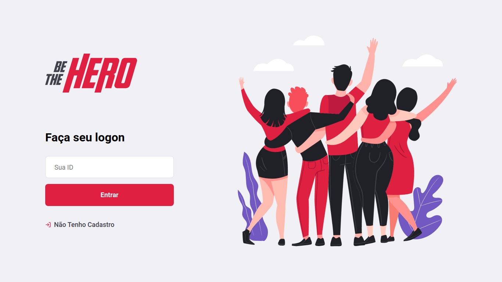

<h1 align="center">
  
</h1>

  
  

<h1 align="center">
  
</h1>

## Tecnologias :computer::

<ul>
   <li>
     <a href="https://nodejs.org/en/">Node.js</a>
  </li>
  
  <li>
    <a href="https://pt-br.reactjs.org/">React</a>
  </li>

  <li>
     <a href="https://reactnative.dev/">React Native</a>
  </li>

  <li>
     <a href="https://expo.io/">Expo</a>
  </li>
</ul>
